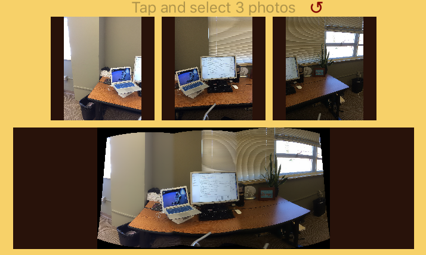
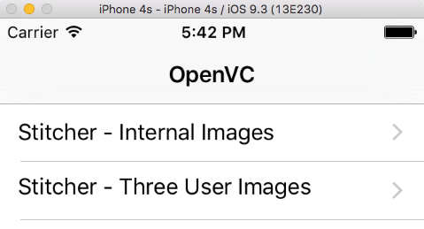

## OpenCV Wrapped for easy use in Swift for iOS
The projects shows how the OpenCV C libraries can be wrapped in an Objective-C framework to enable their easy and direct use in Swift without knowledge of the underlying implementation.

First of all, this work builds on massive work by others including:
* [OpenCV.org](http://opencv.org) home to it all, 
* [github - Foundry - OpenCVSwiftStitch](https://github.com/foundry/OpenCVSwiftStitch) Swift Stitch example used as starting point,
* [github - MichaelGofron - SwiftOpenCV](https://github.com/MichaelGofron/SwiftOpenCV) did not look at, but seems to be built on above.

### General Notes

- Written in Swift 2.2 with Xcode 7.3
- Motivated by my desire to learn about OpenCV and add to the open source community
- To run, __you will need to include the OpenCV framework.__ Too large to include. See next.

### Versions of OpenCV
I have tried several versions of OpenCV with different results. Here are my findings.
* [v3.1](http://sourceforge.net/projects/opencvlibrary/files/opencv-ios/3.1.0/opencv2.framework.zip/download): Works in all Simulators, but does not appear to work on devices because does not include object code for 64 bit arch.
* [v3.0](http://sourceforge.net/projects/opencvlibrary/files/opencv-ios/3.0.0/opencv2.framework.zip/download): Works in Simulators tested, but does not work on my device. Seems it has some absolute paths in the build. See [this](http://stackoverflow.com/q/26978806/4305146).
* [v2.4](https://sourceforge.net/projects/opencvlibrary/files/opencv-ios/2.4.11/opencv2.framework.zip/download): Had other issues related to header imports. Did not investigate further.

After including an OpenCV library referenced above, this code will probably __not__ run on a physical device! Perhaps someone has built a usable framework, or you can do it yourself. Of I might do it later...

### Switching versions of OpenCV
To use a different versioned framework, you need to download and replace `opencv2.framework`. I suggest 1) In project explorer, OpenCVObjectFramwork/Frameworks delete opencv2.framework, to trash. 2) Download from links above new version and drag to Frameworks group. 3) If going to v2.4, update import in stitching.cpp. 4) Clean and build.

### Discussion

OpenCV is implemented in C/C++. Swift is coming on fast and also changing quickly so this code may be out of date by the time you look at it. 
This is starting as a very quick project to see how I'd like to have OpenCV accessible to my Swift iOS code. 
It only covers a very very small part of OpenCV, but demonstrates how such a library could be created so that Swift iOS projects could easily use without needing to understand the underlying implementation.

OpenCV is a C-based framework. This project creates an Objective-C wrapper around that framework and codes the features at a very high level using only Objective-C objects like UIImage.
This implementation makes it very easy to use for a Swift iOS project.

This Xcode project has 2 targets:
* OpenCVObjcFramework - The OpenCV framework wrapped by Objective-C with higher order functions defined.
* OpenCVSwiftDemo - An iOS App demonstrating the use of the framework.

### OpenCVSwiftDemo

The framework allows the OpenCV functions (very few implemented at this time), to be simple used without knowledge of the underlying implementation.
For example, the stitching together of images can be done as follows:

    private func stitch() {
        let image1 = UIImage(named:"image1.jpg")
        let image2 = UIImage(named:"image2.jpg")
        let image3 = UIImage(named:"image3.jpg")
        let image4 = UIImage(named:"image4.jpg")
            
        let imageArray = [image1,image2,image3,image4]
        let stitchedImage = CVWrapper.stitchImages(imageArray)  // Creates new UIImage
    }

This demo has coding for 2 demonstrations:
1) Stitcher - Internal Images: Just uses 4 internal images to do stitching. Same functionally as OpenCVSwiftStitch github project mentioned above, but has my re-organization of the frameworks.
2) Stitcher - Three User Images: Coded to pull photos from physical device, but since does not currently run on physical device, I added photos as default that I took. It will stitch them together if you click on the redo button. Also, clicking on the stitched image will allow you to zoom and see more detail.

### Next

This project could be built out with addition features from OpenCV and make it easily useable by the iOS community. 
In addition to accessing more features of OpenCV, architectural work should be done to to propagate errors back in a meaningful way.
Also, as additional features are implemented, my guess is that it will probably be best to starting implementing some stateful features 
(storing data in the wrapper) for best optimization.

    
### Other Notes on OpenCV v3.0 Issues

see: http://stackoverflow.com/questions/24305211/pch-file-in-xcode-6

